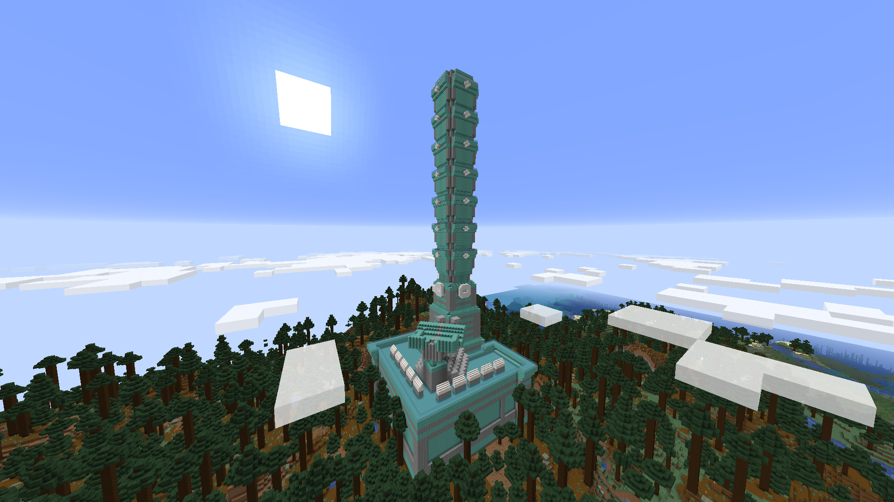

# Mod Schematics in world

# Prerequisites
To run the mod you need to install :

- Minecraft 1.16.5
- Open JDK 1.8
- JRE 1.8 or more

# Build the mod
Thanks to gradle, in the repository folder run the command :
```
# Windows
./gradlew build

# On linux it might be
gradle build

# This will produce a .jar file in the build/libs directory
```
If you want, a .jar file is already available in the build_utils folder.

# Place it in .minecraft
Move the produced .jar file into the .minecraft/mods folder. You also need to move the build_utils/recompile.sh or build_utils/recompile.bat according to your OS into the .minecraft/mods directory.

# How it works ?
Place your schematics in the .minecraft/Schematics folder, you can create it if it's not already the case. Then run minecraft a first time, it'll create a .minecraft/mods/resources folder containing your structures data, you finally need to run the build_utils/recompile.(sh|bat) and restart minecraft.

Now if you create a world, your schematics will randomly spawn, like in the following screenshot :



# Provided mods
If you want, you can use the mods provided in the mods_utils folder to make some experimentations.

# Configuration
In the .minecraft/config/siwstructures you can find a JSON config file for each structures.
